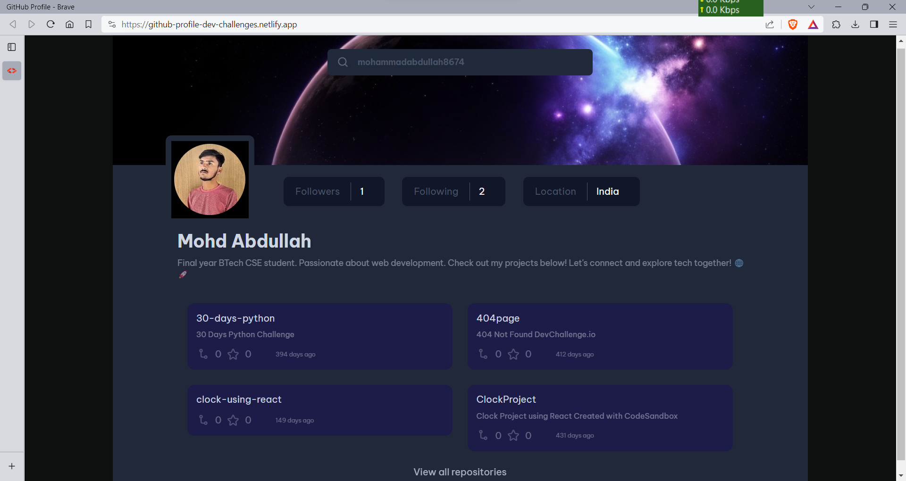
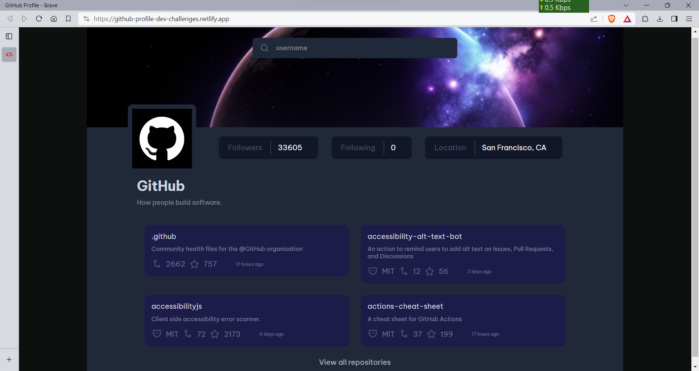

# GitHub Profile App

This project is a solution to the GitHub Profile challenge from devchallenges.io. It is a React-based web application that allows users to search for GitHub profiles and view detailed information.

## Table of Contents

- [Demo](#demo)
- [Features](#features)
- [Screenshots](#screenshot)
- [Run Locally](#run-locally)
- [Technologies Used](#technologies-used)


## Demo

[Live Demo](https://github-profile-dev-challenges.netlify.app/) 
## Screenshots





## Features

- Search for GitHub profiles by username.
- View detailed information about a GitHub user, including their repositories, followers, and following.
- Responsive design for a seamless experience on various devices.


## Run Locally

Clone the project

```bash
  git clone https://github.com/mohammadabdullah8674/Github-Profile
```

Go to the project directory

```bash
  cd my-project
```

Install dependencies

```bash
  npm install
```

Start the server

```bash
  npm run dev
```


Open your browser and visit http://localhost:5173 to view the app.

## Technologies Used 

- React
- GitHub API (for fetching user data)
- HTML5, CSS3 (for styling) 


## 🚀 About Me
Final year BTech CSE student. Passionate about web development. Check out my projects below! Let's connect and explore tech together! 🌐🚀


## 🔗 Links
[](https://mohd-abdullah-personal-portfolio.vercel.app/)
[](https://linkedin.com/in/mohd-abdullah-zubair)
[](https://instagram.com/i_am_abdullahzubair)
